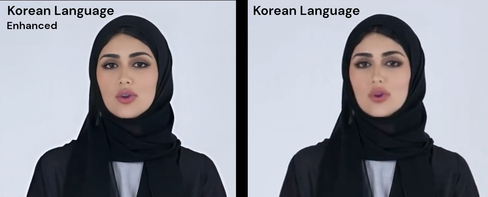

# Lip-Syncing Video Project

## Overview

This project is focused on creating high-quality lip-synced videos by processing face videos and synchronizing them with provided audio. The project consists of four main steps, each thoroughly investigated in separate notebooks:

1. **Language Detection and Audio to Text Conversion**
2. **Lip-Syncing using Wav2Lip Models**
3. **Video Quality Enhancement**
4. **Performance Evaluation**

## 1. Language Detection and Audio to Text Conversion

### Purpose:
To understand the input data and determine how the lip-sync model may perform.

### Key Steps:
- **Import face video and audio files.**
- **Video and Audio Analysis:** Implemented functions like `get_video_details` and `get_audio_details` to extract key details.
- **Audio to Text Conversion:** Used OpenAI's Whisper model for transcription and `langdetect` for language detection.
- **Face and Audio Extraction:** Extracted faces from random frames using the MTCNN model and corresponding audio clips.
- **Data Storage:** Saved translations, language, and frames in a `.txt` file for further analysis.

## 2. Lip-Syncing using Wav2Lip Models

### Purpose:
To generate synchronized lip movements in the face video using different models.

### Key Steps:
- **Model Selection:** Wav2Lip was chosen for its robust documentation and community support.
- **Model Comparison:** Evaluated Wav2Lip against other models like Echomimic and MuseTalk.
- **Implementation:** Modified scripts to enhance video quality and trimmed audio for better synchronization.
- **Video Generation:** Generated videos using both `wav2lip_gen.pth` and `wav2lip.pth` models for comparison.

### Selected Model: Wav2Lip
**Reason for Selection:** Strong documentation, ease of use, and proven performance.

### Comparison with Other Models:
- **Wav2Lip:** High-quality output, easy to implement.
- **Echomimic & MuseTalk:** Require more fine-tuning and expertise.

## 3. Video Quality Enhancement

### Purpose:
To restore and enhance the quality of videos after lip-syncing.

  
  
*Before and After: Enhancing Video Quality Post Lip-Syncing*

### Key Technology: GFPGAN v1.4
GFPGAN (Generative Facial Prior GAN) is used to restore and enhance facial details in the videos, which may have been degraded during the face detection process.

### How GFPGAN Works:
- **Face Detection:** Uses RetinaFace to locate and extract faces.
- **Landmark Detection:** Identifies key facial points for precise restoration.
- **Image Restoration:** Applies generative facial priors to reconstruct facial details, enhancing clarity and resolution.

### Applications:
- **Photo and Video Restoration:** Particularly useful for improving low-resolution videos and restoring old footage.

## 4. Performance Evaluation

### Purpose:
To assess the alignment between audio and video using standard metrics.

### Metrics Used:
- **LSE-D (Lip-Sync Error-Displacement):** Measures the displacement error between ground truth and generated lip landmarks.
- **LSE-C (Lip-Sync Error-Confidence):** Evaluates the confidence of the model in its lip-sync predictions.

### Application:
These metrics were used to quantitatively assess the performance of the lip-syncing models, helping in refining and improving the model’s output.

## Results Discussion

### Analysis of FID Values

The Fréchet Inception Distance (FID) values indicate the similarity between the generated images and the ground truth images. Lower FID values suggest higher similarity and better quality. The following are the FID values for `wav2lip_gen.pth` and `wav2lip.pth` models across different languages:

### FID Values for `wav2lip_gen.pth` and `wav2lip.pth`

| Language | FID (wav2lip_gen.pth) | FID (wav2lip.pth) |
|----------|-----------------------|-------------------|
| Korean   | 2.3120862558399153    | 2.3007421794956375 |
| Arabic   | 2.280514213509388     | 2.3549242277811224 |
| Spanish  | 2.389169484441494     | 2.3006673257909256 |
| English  | 2.4446369026039747    | 2.3435178692535867 |

### Insights:
- **wav2lip_gen.pth** showed slightly better FID values in Arabic and Spanish, suggesting it may handle certain languages more effectively.
- **wav2lip.pth** performed marginally better in Korean and English, indicating it could be more suited for these languages.

## Analysis of the Results

| Video                          | LSE-D      | LSE-C      | Model          |
|--------------------------------|------------|------------|----------------|
| Arabic_not_gen_model.mp4       | 7.452433   | 6.8285794  | wav2lip.pth    |
| English_not_gen_model.mp4      | 7.2815084  | 7.450014   | wav2lip.pth    |
| Korean_not_gen_model.mp4       | 7.900413   | 6.4207473  | wav2lip.pth    |
| Spanish_not_gen_model.mp4      | 7.7730327  | 6.183518   | wav2lip.pth    |
| Arabic_gen_model.mp4           | 7.4505444  | 6.946064   | wav2lip_gen.pth|
| English_gen_model.mp4          | 7.3036866  | 7.7088923  | wav2lip_gen.pth|
| Korean_gen_model.mp4           | 8.0658455  | 6.2819786  | wav2lip_gen.pth|
| Spanish_gen_model.mp4          | 7.7571344  | 6.3895636  | wav2lip_gen.pth|

### Analysis of the Results:
- **LSE-D and LSE-C Values:** The generated model (`wav2lip_gen.pth`) generally provided slightly better LSE-C scores, indicating higher confidence in the lip-syncing, while LSE-D values varied.
- **Language Performance:** The models showed variability in performance across different languages, with no clear winner for all metrics.

### Conclusion:
Both models have their strengths, with `wav2lip_gen.pth` offering better confidence in some cases, while `wav2lip.pth` might perform better in aligning lip movements with the audio in other languages. Further tuning and experimentation could optimize performance based on specific language requirements.

